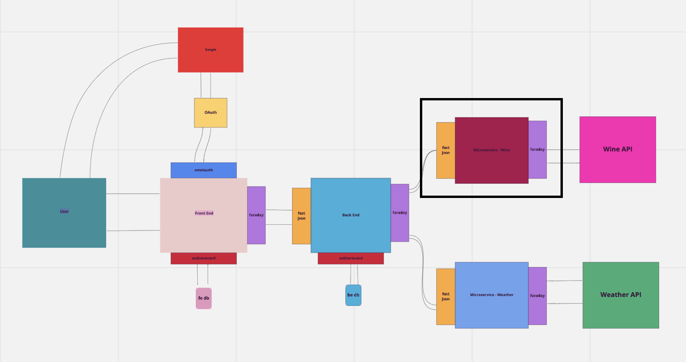

# Weather Vine Wine Microservice

## About this Project
Weather Vine is an educational app for consumers to connect more deeply with the wine they enjoy. Explore wines from a region and see how the climate has influenced the very wine one drinks!   

## Table of Contents

  - [Getting Started](#getting-started)
  - [Running the tests](#running-the-tests)
  - [Service Oriented Architecture](#service-oriented-architecture)
  - [Other Repos](#other-repos)
  - [Built With](#built-with)
  - [Contributing](#contributing)
  - [Versioning](#versioning)
  - [Authors](#authors)
  - [Acknowledgments](#acknowledgments)

## Getting Started

To get the web application running, please fork and clone down the repo.


`git clone <your@github.account:WeatherVine/wine_service.git>`

### Prerequisites

To run this application you will need Ruby 2.5.3 and Rails 5.2.5

### Installing

- Install the gem packages  
  - `bundle install`
- Generate your local `application.yml` file to store the api key and confirm it was added to your `.gitignore`
  - `bundle exec figaro install`

## Running the tests
RSpec testing suite is utilized for testing this application.
- Run the RSpec suite to ensure everything is passing as expected  
`bundle exec rspec`

## Service Oriented Architecture

- The purpose of this microservice is to facilitate the communication between our Weather Vine back-end application and the Wine API that we are consuming by filtering the response as needed.

## Other Repos
- Weather Vine Front-End Application
  - [Repo](https://github.com/WeatherVine/front_end) | [Heroku](https://weathervine-fe.herokuapp.com/)
- Weather Vine Back-End Application
  - [Repo](https://github.com/WeatherVine/back_end) | [Heroku](https://weathervine-be.herokuapp.com/)
- Weather Vine Weather Microservice
  - [Repo](https://github.com/WeatherVine/weather_service) | [Heroku](https://weather-service-sinatra.herokuapp.com/)

## Endpoints

##### QuiniWine API
- Weather Vine has chosen to use Quini Wine Intelligence as the API service due to their available data that best matched Weather Vine's needs.

##### Weather Vine Microservice
- GET `https://wine-service-sinatra.herokuapp.com//api/v1/wine-data?location=napa%20valley&vintage=2008`
```json
{
    "data": [
      {
      "id": null,
      "type": "wines",
      "attributes": {
        "id": null,
        "api_id": "5a820b7154f765b05c5bd94a",
        "name": "Altamura Cabernet Sauvignon 2008",
        "area": "Napa Valley",
        "vintage": "2008"
        }
      },
      {
      "id": null,
      "type": "wines",
      "attributes": {
        "id": null,
        "api_id": "5b1588fcedcff42611e5db3c",
        "name": "Celani Family Cabernet Sauvignon 2008",
        "area": "Napa Valley",
        "vintage": "2008"
        }
      },
      {
      "id": null,
      "type": "wines",
      "attributes": {
        "id": null,
        "api_id": "5205521de817460200000002",
        "name": "Cameron Hughes Lot 200 2008 Cabernet Sauvignon",
        "area": "Napa",
        "vintage": "2008"
        }
      },
      {
      "id": null,
      "type": "wines",
      "attributes": {
        "id": null,
        "api_id": "5a7a782f43780f1b2595a471",
        "name": "Grgich Hills “Estate Grown” 2008",
        "area": "Napa Valley",
        "vintage": "2008"
        }
      },
      {
      "id": null,
      "type": "wines",
      "attributes": {
        "id": null,
        "api_id": "5a7a87e24281413625aa0bc8",
        "name": "Jack Nicklaus Cabernet Sauvignon 2008",
        "area": "Napa Valley",
        "vintage": "2008"
        }
      }
    ]
}
```
- GET `https://wine-service-sinatra.herokuapp.com/api/v1/wine-single?id=5205521de817460200000002`
```json
{
"data": {
    "id": null,
    "type": "w",
    "attributes": {
        "id": null,
        "api_id": "5205521de817460200000002",
        "name": "Cameron Hughes Lot 200 2008 Cabernet Sauvignon",
        "area": "Napa",
        "vintage": "2008",
        "eye": "Opaque rim",
        "nose": "Black Currant, Jam, Berry aromas",
        "mouth": "Black Currant, Woody, Jam, Berry, Coffee flavours",
        "finish": "Long duration, Outstanding quality, Late peaktime",
        "overall": "Complex complexity, Memorable interest, Typical typicity"
      }
    }
}
```

## Built With
- [Sinatra](https://github.com/sinatra/sinatra)
- [Ruby](https://www.ruby-lang.org/en/)
- [RSpec](https://github.com/rspec/rspec)
- [Rbenv](https://github.com/rbenv/rbenv)

## Contributing
Please follow the steps below and know that all contributions you make are **greatly appreciated**.

1. Fork the Project
2. Create your Feature Branch (`git checkout -b feature/<New-Cool-Feature-Name>`)
3. Commit your Changes (`git commit -m 'Add <New-Cool-Feature-Name>'`)
4. Push to the Branch (`git push origin feature/<New-Cool-Feature-Name>`)
5. Open a Pull Request

## Versioning
- Sinatra 2.1.0
- Ruby 2.5.3
- RSpec 3.10.0
- Rbev 1.1.2

## Authors
- **Adam Bowers**
| [GitHub](https://github.com/Pragmaticpraxis37) |
  [LinkedIn](https://www.linkedin.com/in/adam-bowers-06a871209/)
- **Alex Schwartz**
| [GitHub](https://github.com/aschwartz1) |
  [LinkedIn](https://www.linkedin.com/in/alex-s-77659758/)
- **Diana Buffone**
| [GitHub](https://github.com/Diana20920) |
  [LinkedIn](https://www.linkedin.com/in/dianabuffone/)
- **Katy La Tour**
| [GitHub](https://github.com/klatour324) |
  [LinkedIn](https://www.linkedin.com/in/klatour324/)
- **Tommy Nieuwenhuis**
|  [GitHub](https://github.com/tsnieuwen) |
    [LinkedIn](https://www.linkedin.com/in/thomasnieuwenhuis/)
- **Trevor Suter**
|    [GitHub](https://github.com/trevorsuter) |
    [LinkedIn](https://www.linkedin.com/in/trevor-suter-216207203/)
- **Wil McCauley**
|    [GitHub](https://github.com/wil-mcc) |
    [LinkedIn](https://www.linkedin.com/in/wil-mccauley/)
